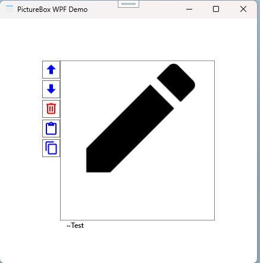

# PictureBox

]

Das Demo zeigt ein UserControl **PictureBox** das eine Liste von Bilder darstellen kann. Zusätzlich gibt es eine Navigationsleiste für Funktionen wie *Auf- und Abblättern, Löschen, Hinzufügen usw.*

